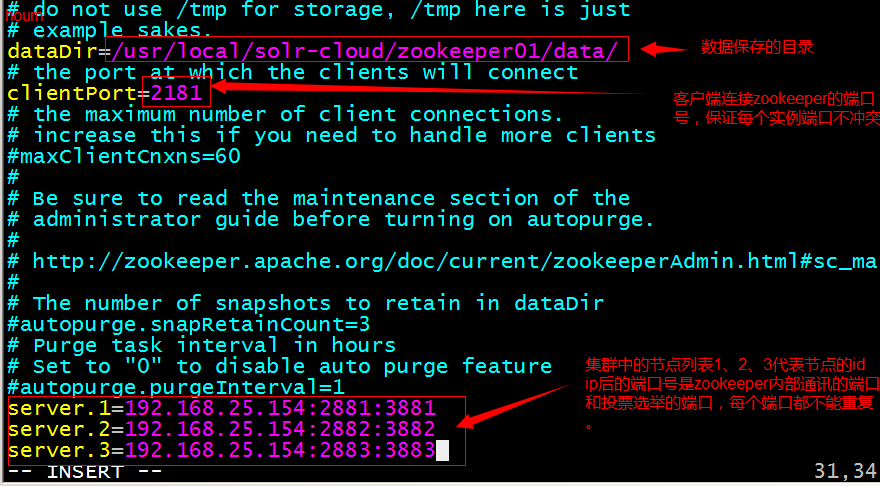
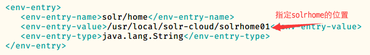
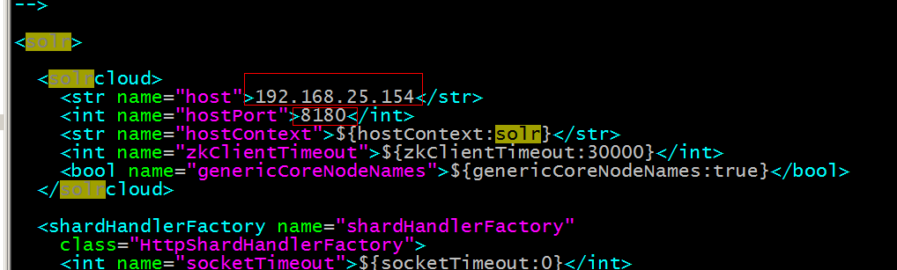
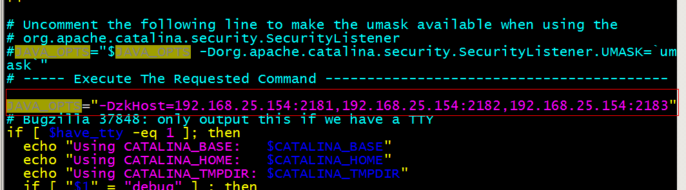

---

typora-copy-images-to: ./
typora-root-url: ./
---

# zookeeper集群的搭建

* 需要安装JDK环境（略）

* 把zookeeper上传到服务器

* 把zookeeper复制三份

  ```bash
  [root@localhost ~]# mkdir /usr/local/solr-cloud
  [root@localhost ~]# cp -r zookeeper-3.4.6 /usr/local/solr-cloud/zookeeper01
  [root@localhost ~]# cp -r zookeeper-3.4.6 /usr/local/solr-cloud/zookeeper02
  [root@localhost ~]# cp -r zookeeper-3.4.6 /usr/local/solr-cloud/zookeeper03
  ```

* 在每个zookeeper目录下创建一个data目录

* 在每个data目录下创建一个myid文件，文件内容就是每个实例的id。例如1、2、3

  ```bash
  [root@localhost data]# echo 1 >> myid
  ```

* 修改配置文件。把conf目录下的zoo_sample.cfg文件改名为zoo.cfg ，并修改zoo.cfg文件,修改内容如下:

  

* 启动每个zookeeper实例，并查看zookeeper的状态

  | 启动:                   | 查看状态:                |
  | ----------------------- | ------------------------ |
  | `bin/zkServer.sh start` | `bin/zkServer.sh status` |

# SolrCloud集群的搭建

* 在/usr/local下创建solr-cloud文件夹

  ```bash
  [root@localhost local]# mkdir solr-cloud
  ```

* 创建四个tomcat实例。每个tomcat运行在不同的端口。8180、8280、8380、8480，放入solr-cloud文件夹

* 解压solr-4.10.3.tar.gz压缩包

  ```bash
  [root@localhost software]# tar zxf solr-4.10.3.tar.gz
  ```

* 进入solr-4.10.3文件夹,复制solr.war到四个tomcat中

  ```bash
  [root@localhost ~]# cd solr-4.10.3/example/webapps
  [root@localhost webapps]#cp -r solr.war /usr/local/solr-cloud/tomcat01/webapps
  [root@localhost webapps]#cp -r solr.war /usr/local/solr-cloud/tomcat02/webapps
  [root@localhost webapps]#cp -r solr.war /usr/local/solr-cloud/tomcat03/webapps
  [root@localhost webapps]#cp -r solr.war /usr/local/solr-cloud/tomcat04/webapps
  ```

* 复制example文件夹下的solr文件夹到solr-cloud中，一共复制4份

  ```bash
  [root@localhost example]# cp -r solr /usr/local/solr-cloud/solrhome01
  [root@localhost example]# cp -r solr /usr/local/solr-cloud/solrhome02
  [root@localhost example]# cp -r solr /usr/local/solr-cloud/solrhome03
  [root@localhost example]# cp -r solr /usr/local/solr-cloud/solrhome04
  ```

* 修改每个tomcat实例下的web.xml文件，把tomcat和solrhome关联起来



* 每个solrhome下都有一个solr.xml，把其中的ip及端口号配置好

  

* 使用工具上传配置文件，进入`solr-4.10.3/example/scripts/cloud-scripts/`

  ```bash
  ./zkcli.sh -zkhost 192.168.25.154:2181,192.168.25.154:2182,192.168.25.154:2183 -cmd upconfig -confdir /usr/local/solr-cloud/solrhome01/collection1/conf -confname myconf
  ```

* 修改tomcat/bin目录下的catalina.sh文件，关联solr和zookeeper

  

* 启动每个tomcat实例

* 创建新的Collection进行分片处理

  `http://192.168.25.154:8180/solr/admin/collections?action=CREATE&name=collection2&numShards=2&replicationFactor=2`

* 删除不用的Collection

  `http://192.168.25.154:8180/solr/admin/collections?action=DELETE&name=collection1`

  