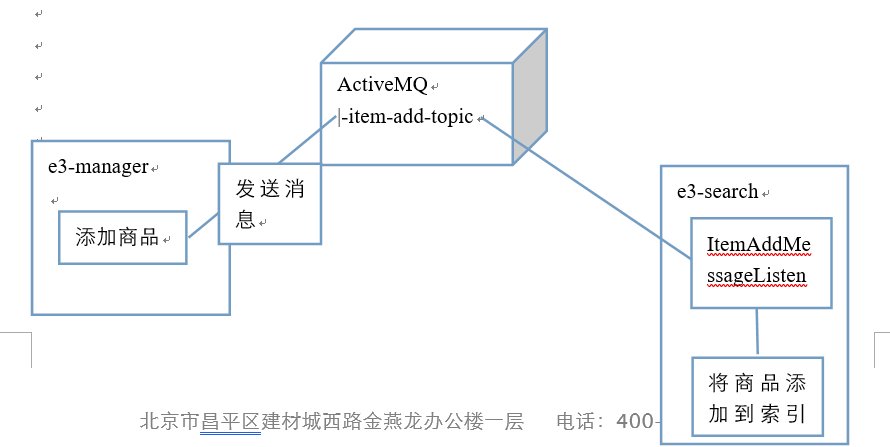

# ActiveMQ整合Spring

* 引入jar包

  ```xml
  <dependency>
      <groupId>org.springframework</groupId>
      <artifactId>spring-jms</artifactId>
      </dependency>
      <dependency>
      <groupId>org.springframework</groupId>
      <artifactId>spring-context-support</artifactId>
  </dependency>
  ```

* 在e3-manager-service工程中新建`applicationContext-activemq.xml`，配置ConnectionFactory

  ```xml
  <?xml version="1.0" encoding="UTF-8"?>
  <beans
          xmlns:xsi="http://www.w3.org/2001/XMLSchema-instance"
          xmlns="http://www.springframework.org/schema/beans"
          xsi:schemaLocation="http://www.springframework.org/schema/beans http://www.springframework.org/schema/beans/spring-beans-4.2.xsd">
  
      <!-- 真正可以产生Connection的ConnectionFactory，由对应的 JMS服务厂商提供 -->
      <bean id="targetConnectionFactory" class="org.apache.activemq.ActiveMQConnectionFactory">
          <property name="brokerURL" value="tcp://192.168.25.130:61616" />
      </bean>
      <!-- Spring用于管理真正的ConnectionFactory的ConnectionFactory -->
      <bean id="connectionFactory"
            class="org.springframework.jms.connection.SingleConnectionFactory">
          <!-- 目标ConnectionFactory对应真实的可以产生JMS Connection的ConnectionFactory -->
          <property name="targetConnectionFactory" ref="targetConnectionFactory" />
      </bean>
  </beans>
  ```

* 配置生产者，在上一步的配置文件中添加如下节点：

  ```xml
  <!-- 配置生产者 -->
  <!-- Spring提供的JMS工具类，它可以进行消息发送、接收等 -->
  <bean id="jmsTemplate" class="org.springframework.jms.core.JmsTemplate">
      <property name="connectionFactory" ref="connectionFactory" />
  </bean>
  <!--这个是队列目的地，点对点的 -->
  <bean id="queueDestination" class="org.apache.activemq.command.ActiveMQQueue">
      <constructor-arg>
          <value>spring-queue</value>
      </constructor-arg>
  </bean>
  <!--这个是主题目的地，一对多的 -->
  <bean id="topicDestination" class="org.apache.activemq.command.ActiveMQTopic">
      <constructor-arg value="topic" />
  </bean>
  ```

* 编写测试代码

  ```java
  @Test
  public void testSpringActiveMq() throws Exception {
      //初始化spring容器
      ApplicationContext applicationContext = new ClassPathXmlApplicationContext("classpath:spring/applicationContext-activemq.xml");
      //从spring容器中获得JmsTemplate对象
      JmsTemplate jmsTemplate = applicationContext.getBean(JmsTemplate.class);
      //从spring容器中取Destination对象
      Destination destination = (Destination) applicationContext.getBean("queueDestination");
      //使用JmsTemplate对象发送消息。
      jmsTemplate.send(destination, new MessageCreator() {
          @Override
          public Message createMessage(Session session) throws JMSException {
              //创建一个消息对象并返回
              TextMessage textMessage = session.createTextMessage("spring activemq queue message");
              return textMessage;
          }
      });
  }
  ```

* 要接收消息，需要先**创建一个MessageListener的实现类**

  ```java
  public class MyMessageListener implements MessageListener {
      @Override
      public void onMessage(Message message) {
          TextMessage textMessage = (TextMessage) message;
          try {
              String text = textMessage.getText();
              System.out.println(text);
          } catch (JMSException e) {
              e.printStackTrace();
          }
      }
  }
  ```

* 在e3-search-service工程中新建`applicationContext-activemq.xml`，添加如下配置：（**注：与e3-manager-service工程的配置文件相比，少了JMSTemplate，多了Listener和消息监听容器**）

  ```xml
  <?xml version="1.0" encoding="UTF-8"?>
  <beans
          xmlns:xsi="http://www.w3.org/2001/XMLSchema-instance"
          xmlns="http://www.springframework.org/schema/beans"
          xsi:schemaLocation="http://www.springframework.org/schema/beans http://www.springframework.org/schema/beans/spring-beans-4.2.xsd">
  
      <!-- 真正可以产生Connection的ConnectionFactory，由对应的 JMS服务厂商提供 -->
      <bean id="targetConnectionFactory" class="org.apache.activemq.ActiveMQConnectionFactory">
          <property name="brokerURL" value="tcp://192.168.25.130:61616" />
      </bean>
      <!-- Spring用于管理真正的ConnectionFactory的ConnectionFactory -->
      <bean id="connectionFactory"
            class="org.springframework.jms.connection.SingleConnectionFactory">
          <!-- 目标ConnectionFactory对应真实的可以产生JMS Connection的ConnectionFactory -->
          <property name="targetConnectionFactory" ref="targetConnectionFactory" />
      </bean>
      <!--这个是队列目的地，点对点的 -->
      <bean id="queueDestination" class="org.apache.activemq.command.ActiveMQQueue">
          <constructor-arg value="spring-queue"/>
      </bean>
      <!--这个是主题目的地，一对多的 -->
      <bean id="topicDestination" class="org.apache.activemq.command.ActiveMQTopic">
          <constructor-arg value="itemAddTopic" />
      </bean>
      <!--Listener-->
      <bean id="myMessageListener" class="cn.e3mall.search.message.MyMessageListener"/>
      <!--商品添加同步solr索引库Listener-->
      <bean id="itemAddMessageListener" class="cn.e3mall.search.message.ItemAddMessageListener"/>
      <!-- 消息监听容器 -->
      <bean class="org.springframework.jms.listener.DefaultMessageListenerContainer">
          <property name="connectionFactory" ref="connectionFactory" />
          <property name="destination" ref="topicDestination" />
          <property name="messageListener" ref="itemAddMessageListener" />
      </bean>
  </beans>
  ```

* 编写测试代码（接受消息）

  ```java
  @Test
  public void testQueueConsumer() throws Exception {
      // 初始化spring容器
      ApplicationContext applicationContext = new ClassPathXmlApplicationContext("classpath:spring/applicationContext-activemq.xml");
      // 等待
      System.in.read();
  }
  ```

# 添加商品时同步到索引库

* 修改e3-manager-service的activemq配置文件：

  ```xml
  <!--这个是主题目的地，一对多的 -->
  <bean id="topicDestination" class="org.apache.activemq.command.ActiveMQTopic">
  	<constructor-arg value="itemAddTopic" />
  </bean>
  ```

* 在新增商品时把商品id作为消息发送

  ```java
  // ItemServiceImpl.java
  public E3Result addItem(TbItem tbItem, String desc) {
      long itemId = IDUtils.genItemId();
      tbItem.setId(itemId);
      //商品状态，1-正常，2-下架，3-删除
      tbItem.setStatus((byte) 1);
      tbItem.setCreated(new Date());
      tbItem.setUpdated(new Date());
      TbItemDesc tbItemDesc = new TbItemDesc();
      tbItemDesc.setItemId(itemId);
      tbItemDesc.setCreated(new Date());
      tbItemDesc.setUpdated(new Date());
      tbItemDesc.setItemDesc(desc);
      itemMapper.insert(tbItem);
      tbItemDescMapper.insert(tbItemDesc);
      // 发送消息
      jmsTemplate.send(topicDestination, new MessageCreator() {
          @Override
          public Message createMessage(Session session) throws JMSException {
              return session.createTextMessage(itemId + ""); }
      });
      return E3Result.ok();
  }
  ```

* 编写新增商品监听器，接受到消息以后开始同步索引库

  ```java
  public class ItemAddMessageListener implements MessageListener {
      @Autowired
      private ItemMapper itemMapper;
      @Autowired
      private SolrServer solrServer;
      @Override
      public void onMessage(Message message) {
          try {
              // 获取商品id
              TextMessage textMessage = (TextMessage) message;
              String text = textMessage.getText();
              Long itemId = Long.valueOf(text);
              // 等待事务提交
              Thread.sleep(100);
              // 通过商品id获取SearchItem对象
              SearchItem searchItem = itemMapper.getSearchItemByItemId(itemId);
              // 同步到solr索引库
              SolrInputDocument document = new SolrInputDocument();
              document.addField("id", searchItem.getId());
              document.addField("item_title", searchItem.getTitle());
              document.addField("item_price", searchItem.getPrice());
              document.addField("item_sell_point", searchItem.getSell_point());
              document.addField("item_image", searchItem.getImage());
              document.addField("item_category_name", searchItem.getCategory_name());
              solrServer.add(document);
              // 提交
              solrServer.commit();
          } catch (Exception e) {
              e.printStackTrace();
          }
      }
  }
  ```

* 修改e3-search-service的activemq配置文件，配置监听：

  ```xml
  <!--商品添加同步solr索引库Listener-->
  <bean id="itemAddMessageListener" class="cn.e3mall.search.message.ItemAddMessageListener"/>
  <!-- 消息监听容器 -->
  <bean class="org.springframework.jms.listener.DefaultMessageListenerContainer">
      <property name="connectionFactory" ref="connectionFactory" />
      <property name="destination" ref="topicDestination" />
      <property name="messageListener" ref="itemAddMessageListener" />
  </bean>
  ```

* 大概实现流程如图：

  